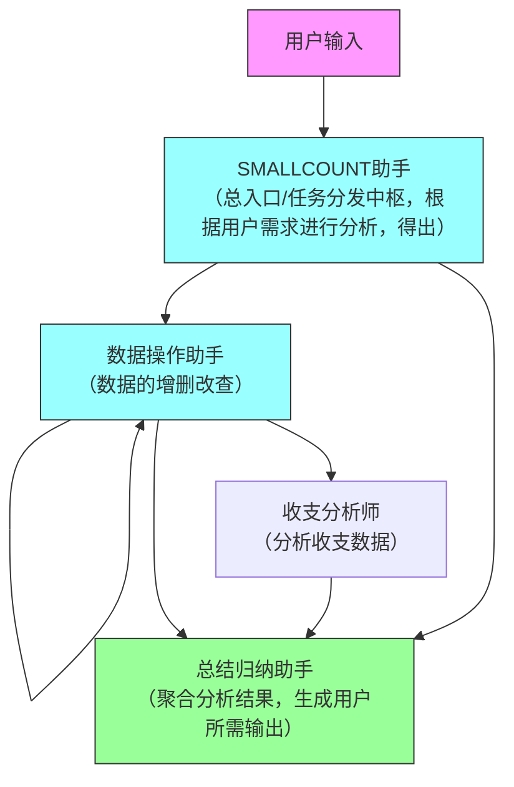

# AI 协作者模式架构

# 解释
1. SMALLCOUNT助手：负责分析用户输入，回答用户有关app的问题，分析用户输入，根据用户需求分派任务给不同的智能体。
2. 数据操作助手：负责使用对应工具获取用户实际的收支情况（查），或根据用户需求进行数据操作（增删改）。
3. 收支分析师：负责使用对应工具获取用户实际的收支数据，分析用户的收入情况。
4. 总结归纳助手：负责根据收支分析师的分析结果，生成符合用户需求的输出，或总结smallcount助手的结果回答，或根据用户需求进行数据操作后的结果总结。